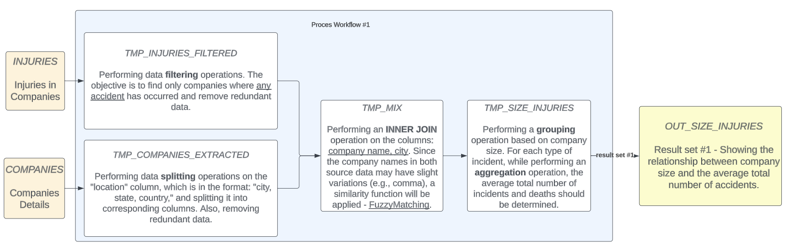

# Goal
Wrocław University of Science and Technology

The project's main goal was to model and implement big data processes. The project consisted of 10 stages described below.

# Stages
1. Project Assumptions
    - Selection of source datasets and determination of their content and availability. Indication of expected data processing results.
2. Source Data for Input
    - Find 2 datasets on the web, 100MB minimum each and analyze them.
    - For each data source, provide a description of the content, including attributes, their types, and an example of the content.
3. Data for Output
    - Describe the structure of the resulting dataset, including attributes, their types, and an example of the content.
4. Model Data Processes.
    - **Required implementation of data merging from various sources, data aggregation, and data transformation operations.**
    - Development of a method for deriving the resulting dataset based on the source data. Identification of intermediate stages of data processing and the obtained temporary data.
5. Hadoop
    - Installation and execution of a Hadoop cluster in a Docker environment with at least 3 nodes.
6. Data Acquisition
    - Downloading the source data and storing it in the Hadoop Distributed File System (HDFS). Automating the process of retrieving data that undergoes changes in the source system.
    - Log the timestamp, size of the data, and the status of the process
    - 3 replicas in HDFS.
7. PIG
    - Installation and execution of PIG in the cluster.
8. PIG - data processing workflows implementation
    - Prepare the implementation of the previously designed data processing workflows using PIG on the Hadoop platform. Log execution times and errors of every stage.
9. Spark
    - Installation and execution of Spark in the cluster.
10. Spark - data processing workflows implementation
    - Prepare the implementation of the previously designed data processing workflows using Spark on the Hadoop platform. Log execution times and errors of every stage.
11. Conclusion & PIG vs Spark
    - Compare those tools basing on the data gathered.
    - Write conclusions

# Project's Final Conclusions
The identified bottleneck is the similarity classification function, which has high complexity due to inefficient data joining. To improve this function in the future, when running processes on full data sets instead of just 10%, an initial classification could be performed, such as checking only if the first letter matches. This could positively impact execution time by reducing memory complexity. In the current case of joining data by city, there is either one or no companies from the first dataset in the second dataset, resulting in inefficient computations. The efficiency of the string similarity algorithm implementation is also crucial.

The difference in execution time between Spark (~4m30s) and PIG (~21m) could be attributed to the fact that the temporary dataset tmp_injuries_filtered had a size of 1.6MB in Spark, while it was 6MB in PIG.

# Issues to address
- RAM memory tuning
- bottlenecks identification
- efficient queries
- fuzzy matching concept

# Workflows and Results
## Workflow 1

## Result 1

## Workflow 2

## Result 2

# Datasets origins
## Dataset 1 origin
https://www.kaggle.com/datasets/robikscube/osha-injury-data-20162021
## Dataset 2 origin
https://www.kaggle.com/datasets/peopledatalabssf/free-7-million-company-dataset
